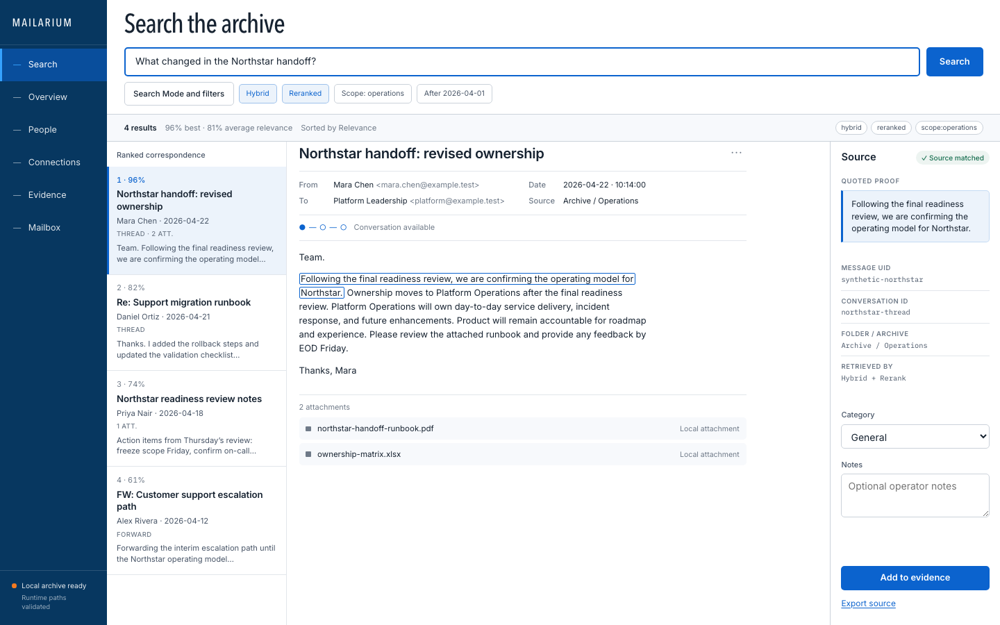
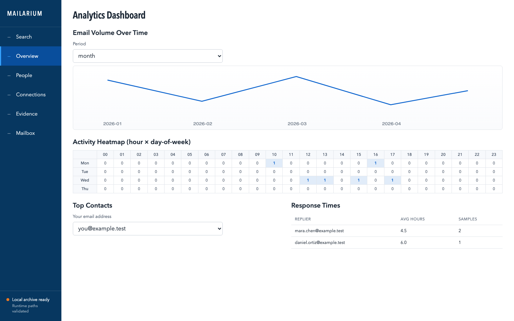
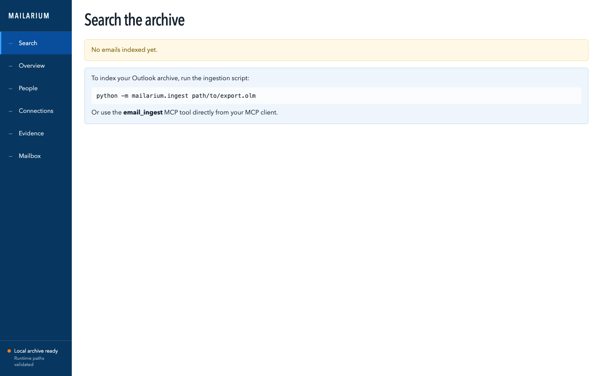

# Mailarium

Mailarium indexes Outlook `.olm` archives for local search, review, analysis,
and export. It provides a terminal interface, a Streamlit interface, and an MCP
server over the same SQLite archive.

Current package version: `0.5.0a1`. The project is in alpha, so commands,
storage contracts, and defaults may change within the `0.5.x` line.

## Purpose and scope

Mailarium is for operators who need to inspect an exported Outlook mailbox
without uploading the archive to a hosted search service. It parses messages
and selected attachments, stores searchable records in SQLite, and builds a
rebuildable USearch index for faster vector lookup.

The project is not a mail client, hosted service, legal case-management system,
or replacement for reviewing the original message. Optional EWS support can
read from and submit controlled actions to an explicitly configured
on-premises mailbox.

## Current capabilities

- Ingest Outlook `.olm` archives, including incremental and resumable runs.
- Search by semantic similarity, BM25, metadata filters, date ranges, topics,
  clusters, and optional reranking.
- Browse messages and inspect threads, people, entities, attachments, and
  archive statistics.
- Export messages, threads, evidence reports, archive reports, and GraphML
  communication networks.
- Use CLI subcommands for repeatable terminal workflows.
- Use Streamlit for trusted-local review.
- Expose 54 MCP tools for structured search, evidence, analytics,
  administration, and optional EWS workflows.

SQLite vectors + USearch is the current storage design. SQLite is authoritative
for messages, metadata, identifiers, and dense vectors. USearch is derived
acceleration and can be rebuilt from SQLite.

## Limitations

- Package metadata requires Python `>=3.14.6,<3.15`; CI uses Python 3.14.6.
- The supported operator runtime is macOS 14 or later on Apple Silicon. CI also
  runs source checks on Ubuntu, but that job is not an operator-runtime claim.
- Streamlit has no authentication and must remain bound to a trusted local
  interface.
- First-run model loading may contact Hugging Face. Offline operation requires
  cached model files and local-only configuration. Entity extraction can
  separately invoke spaCy's downloader unless it is disabled.
- Rich attachment extraction depends on optional Python packages and local
  executables. See [attachment support](docs/ATTACHMENT_SUPPORT.md).
- PDF export requires the optional `weasyprint` package and falls back to HTML
  when that package is absent.
- Live EWS writes have not been verified for the current alpha candidate.
- Retrieval ranks and derived summaries require review against source messages.

## Requirements

- macOS 14 or later on Apple Silicon
- Python 3.14.6, matching CI
- `git`
- Enough disk space for the `.olm` archive, SQLite database, model cache, and
  rebuildable vector index
- Network access for the first model download, unless the required models are
  already cached

Optional features require:

- `tesseract` and `pdftoppm` for OCR paths
- `PyPDF2`, `python-docx`, `openpyxl`, and `python-pptx` for richer attachment
  parsing
- the `ews` or `ews-ntlm` package extra for EWS

## Installation

Clone the repository and create an isolated environment:

```bash
git clone https://github.com/sebastianspicker/outlook-email-rag.git
cd outlook-email-rag
python3.14 -m venv .venv
source .venv/bin/activate
python -m pip install --upgrade pip
python -m pip install -e .
```

For development, install the locked environment used by CI:

```bash
python -m pip install "uv==0.10.7"
uv lock --check
uv sync --locked --extra dev --extra nlp --extra image --extra training --extra ews-ntlm
```

## Configuration

Copy the tracked template:

```bash
cp .env.example .env
```

For a source checkout, the template keeps live state under ignored paths:

```dotenv
VECTOR_INDEX_PATH=private/runtime/current/vector-index
SQLITE_PATH=private/runtime/current/email_metadata.db
RUNTIME_PROFILE=quality
EMBEDDING_LOAD_MODE=auto
```

The main settings are:

| Variable | Purpose |
| --- | --- |
| `VECTOR_INDEX_PATH` | Rebuildable USearch index directory |
| `SQLITE_PATH` | SQLite archive path |
| `RUNTIME_PROFILE` | `balanced`, `quality`, `low-memory`, or `offline-test` |
| `EMBEDDING_LOAD_MODE` | `auto`, `local_only`, or `download` |
| `DEVICE` | `auto`, `cpu`, `mps`, or `cuda` |
| `RAG_SCOPE` | Default explicit retrieval scope |
| `TOP_K` | Default result count |
| `LOG_LEVEL` | Python logging level |
| `MAILARIUM_RUNTIME_HOME` | Absolute runtime root for an installed package |
| `MAILARIUM_ALLOWED_OUTPUT_ROOTS` | Additional absolute export roots |
| `MAILARIUM_ALLOWED_LOCAL_READ_ROOTS` | Additional absolute input roots |
| `MAILARIUM_ALLOWED_RUNTIME_ROOTS` | Additional absolute runtime roots |

The `quality` profile enables hybrid retrieval and cross-encoder reranking.
Learned sparse retrieval, late interaction, and image search remain explicit
opt-ins. Model identifiers and immutable revisions are documented in
[runtime tuning](docs/RUNTIME_TUNING.md).

Removed variables such as `CHROMADB_PATH`, `COLLECTION_NAME`,
`COLBERT_RERANK_ENABLED`, and `MPS_FLOAT16` cause startup to fail when they have
non-empty values. Remove them from the process environment and `.env`.

## Usage

For a source checkout, place an Outlook export below the ignored `private/`
directory, then ingest it:

```bash
mkdir -p private/ingest private/runtime/current private/exports
mailarium-ingest private/ingest/archive.olm
```

Run a bounded first pass when evaluating a new archive:

```bash
mailarium-ingest private/ingest/archive.olm --max-emails 200
```

Search and inspect the archive:

```bash
mailarium search "project handoff" --scope customer-support --hybrid
mailarium browse --page 1 --page-size 20
mailarium analytics stats
mailarium export report --output private/exports/report.html
```

CLI subcommands are the supported command interface. Run these references
against the installed environment:

```bash
mailarium --help
mailarium-ingest --help
python -m mailarium.cli --help
python -m mailarium.ingest --help
```

See the [CLI reference](docs/CLI_REFERENCE.md) for subcommands and options.

### Streamlit

Start the trusted-local interface from a source checkout:

```bash
python -m streamlit run mailarium/web_app.py --server.address 127.0.0.1
```

The current pages are Search, Overview, People, Connections, Evidence, and
Mailbox. The images below are synthetic 1440 by 900 documentation captures
from maintained HTML fixtures, not live Streamlit sessions.







### MCP

Mailarium exposes 54 MCP tools by default. Start the stdio server with the
environment’s absolute Python path:

```bash
.venv/bin/python -m mailarium.mcp_server
```

`python -m mailarium` starts the same MCP server. Configure an MCP client with
the absolute interpreter path and repository working directory. See
[MCP tools](docs/MCP_TOOLS.md) for the registered surface and safety
boundaries.

## Repository structure

```text
mailarium/
├── mailarium/                 Python package
│   ├── tools/                 MCP tool modules
│   └── templates/             HTML export templates
├── tests/                     Unit, integration, contract, and fixture tests
├── scripts/                   Verification, maintenance, and smoke-test tools
├── docs/                      Public technical references and images
├── data/                      Sanitized tracked examples only
├── private/                   Ignored live inputs, runtime state, and exports
├── .github/workflows/ci.yml   CI definition
├── .env.example               Configuration template
├── pyproject.toml             Package metadata and tool configuration
└── uv.lock                    Locked dependency graph
```

The package uses a flat `mailarium/` layout. There is no active `src/`
namespace.

## Development workflow

Keep changes focused and use synthetic fixtures. Run the narrowest relevant
test first, then the repository checks:

```bash
uv run ruff check .
uv run ruff format --check .
uv run mypy mailarium
uv run pytest -q
uv run python scripts/privacy_scan.py --tracked-only --json
```

The broader source, test, runtime-smoke, and security matrix is:

```bash
bash scripts/run_acceptance_matrix.sh
```

Run the privacy scan separately. The local matrix may skip its dependency audit
when PyPI is unreachable.

See [CONTRIBUTING.md](CONTRIBUTING.md) for review and submission expectations.

## Testing

CI uses Python 3.14.6 and runs:

- lockfile validation
- Ruff lint and format checks
- mypy
- pytest with an 80 percent coverage threshold
- Streamlit smoke tests
- Bandit
- dependency and privacy scans
- wheel and source distribution builds
- release-artifact inspection
- installed-wheel smoke tests

Tests use synthetic mailbox records and fixtures. Live mailbox access is not
part of the default test suite.

## Deployment and operation

The repository does not contain a container image, hosted-service manifest, or
public-network deployment configuration. Supported operation is local:

1. Keep the original `.olm` file as the recovery source.
2. Store live data under `private/` in a source checkout or under an absolute
   `MAILARIUM_RUNTIME_HOME` for an installed package.
3. For an installed package, set `MAILARIUM_ALLOWED_OUTPUT_ROOTS` to an
   absolute writable directory and use absolute export paths inside it.
4. Back up the SQLite database and original archive.
5. Treat the USearch directory as rebuildable.
6. Keep Streamlit on `127.0.0.1`.
7. Review every export before sharing it.

Installed packages resolve relative runtime paths under the platform user-data
directory:

| Platform | Default runtime home |
| --- | --- |
| macOS | `~/Library/Application Support/mailarium` |
| Windows | `%LOCALAPPDATA%/mailarium` |
| Linux | `${XDG_DATA_HOME:-~/.local/share}/mailarium` |

Set `MAILARIUM_RUNTIME_HOME` to an absolute path to override the default.
Mailarium does not migrate an older runtime automatically. Follow
[usage and operations](docs/README_USAGE_AND_OPERATIONS.md) before moving an
existing archive.

## Troubleshooting

### Startup reports removed environment variables

Delete the reported obsolete names from `.env` and the parent process
environment. Current storage uses `VECTOR_INDEX_PATH` and `SQLITE_PATH`.

### No messages are indexed

Confirm that the `.olm` path exists and is readable, and that `SQLITE_PATH` and
`VECTOR_INDEX_PATH` are writable. Retry with
`--max-emails 200` to isolate parsing or model-loading failures.

### Model loading fails

Check `RUNTIME_PROFILE`, `EMBEDDING_LOAD_MODE`, `DEVICE`, and the configured
model revisions. With `local_only`, all required files must already exist in
the local model cache.

### MCP does not start

Run `.venv/bin/python -m mailarium.mcp_server --version` in the configured
working directory. Confirm that the client uses the same absolute interpreter
path and that no second process holds the archive lock.

### Streamlit is unreachable

Start it from the repository root with the documented command and open the
loopback URL printed by Streamlit. Do not change the bind address to a public
interface without adding authentication and transport controls outside this
project.

### PDF export returns HTML

HTML is the baseline export format. Install WeasyPrint in the active
environment, verify it, then inspect the returned path and actual format:

```bash
python -m pip install weasyprint
weasyprint --version
```

## Security considerations

Mailbox archives, attachments, SQLite databases, indexes, and exports can
contain sensitive data. Keep them out of version control. Input parsers treat
OLM, XML, MIME, and attachment content as untrusted. MCP-provided local read
paths and all runtime and output paths are checked
against purpose-specific allowlists. The ingest CLI accepts a direct `.olm`
path. New exports do not overwrite existing files.

Streamlit and MCP are trust boundaries. They are not unauthenticated public
services. First-run model resolution can make network requests. EWS credentials
must remain in environment variables and must not be stored in SQLite or
documentation.

Report vulnerabilities through [SECURITY.md](SECURITY.md).

## Contributing

Use synthetic data in issues, tests, and screenshots. Include tests for behavior
changes, update the owning reference when a public contract changes, and list
checks that were skipped. Do not commit live archives, private paths, databases,
model caches, exports, or credentials.

See [CONTRIBUTING.md](CONTRIBUTING.md) and the
[documentation index](docs/README.md).
