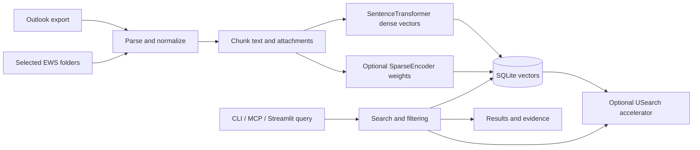
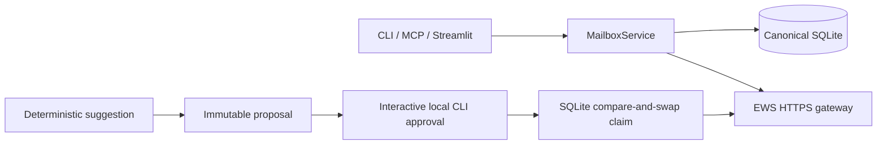

# Architecture and Retrieval Methods

Mailarium is a local-first system for Outlook `.olm` archives. It normalizes
mail and attachments, stores canonical records in SQLite, and exposes search,
evidence, analytics, and exports through CLI, MCP, and Streamlit surfaces.

## Storage and retrieval

SQLite is authoritative for chunk IDs, documents, metadata, vectors, sparse
weights, provenance, and workflow data. `SQLiteVectorCollection` performs
exact vector ranking and may maintain a rebuildable USearch accelerator. The
accelerator is derived state, so a missing or invalid accelerator never makes
canonical archive data unavailable.

EWS is a source adapter, not a second product or search database. Both OLM and
EWS records enter the same normalization, chunking, SQLite, and vector pipeline.
Remote item IDs and change keys are maintained in source-mapping tables because
Exchange can change them during moves; canonical email UIDs remain stable.
Full-refresh generations advance only after their item/source updates are
durable. Mailbox-only tombstones remain auditable in source history but are
filtered from ordinary search and browse results; canonical rows that existed
from another source remain visible. A copied item keeps one canonical vector
projection and is exposed through the union of its active source folders.
Read-flag changes are refreshed as item updates; unsupported or malformed sync
change classes fail closed before the cursor can advance.



Mailbox mutations use a separate durable control path:



MCP can propose and execute an already-approved intent but has no approval or
rejection tool. Expected item IDs/change keys are bound to the proposal; stale
state conflicts instead of silently rebasing. A digest of the non-secret
account configuration is bound as well, preventing execution after endpoint,
mailbox, authentication-mode, or credential-reference drift. Create/send
requests carry a `MailariumProposalId` correlation property so an ambiguous
transport result can be reconciled without blindly resending.

Dense retrieval maps a query and chunk into one embedding space and returns
nearest candidates. Sparse retrieval is optional and stores positive
feature-weight maps in SQLite. BM25 remains the lexical fallback when sparse
encoding is unavailable.

Hybrid retrieval uses deterministic weighted reciprocal-rank fusion:

```text
RRF(d) = sum_j w_j(query) / (60 + rank_j(d))
```

Weights derive from observable query shape. Exact phrases, identifiers,
addresses, and filenames favor lexical retrieval; questions and longer natural
language favor semantic retrieval. Scores are ranking signals, not evidence of
truth.

## Reranking

An explicitly configured local late-interaction runner may rerank a bounded
candidate set through a versioned JSON protocol. The protocol returns bounded
scores and preserves source metadata. Its late-interaction score is:

```text
S(q, d) = (1 / |q|) * sum_i max_j cos(q_i, d_j)
```

If that optional backend is unavailable or fails validation, retrieval falls
back to the configured cross-encoder. Both paths are retrieval-time operations;
they do not train on mailbox queries or content.

## Synthetic request example

For a scoped question such as:

```text
How did the customer-support handoff change after the schedule update?
```

the caller can supply `scope="customer support"`. Query shape selects the
semantic-weighted policy, while the explicit scope enriches only the semantic
context. The response diagnostics expose the resolved scope, semantic and
keyword weights, and reason codes. A client can then request
`email_deep_context` for a selected UID or `email_answer_context` for a bounded,
citable answer contract.

## Limits and review

Archive completeness, attachment extraction, OCR quality, model versions, and
runtime index state affect recall. Results must be verified against the
underlying messages and attachments. The system improves discovery and
provenance, but does not replace human review.

## Sources

- Robertson and Zaragoza, "The Probabilistic Relevance Framework: BM25 and Beyond."
- Khattab and Zaharia, "Efficient and Effective Passage Search via Contextualized Late Interaction over BERT."
- SentenceTransformers documentation for dense and sparse encoders.
- USearch documentation for optional local vector acceleration.
- Model Context Protocol tools specification.
